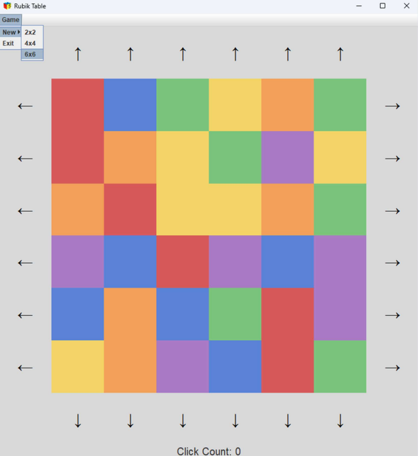
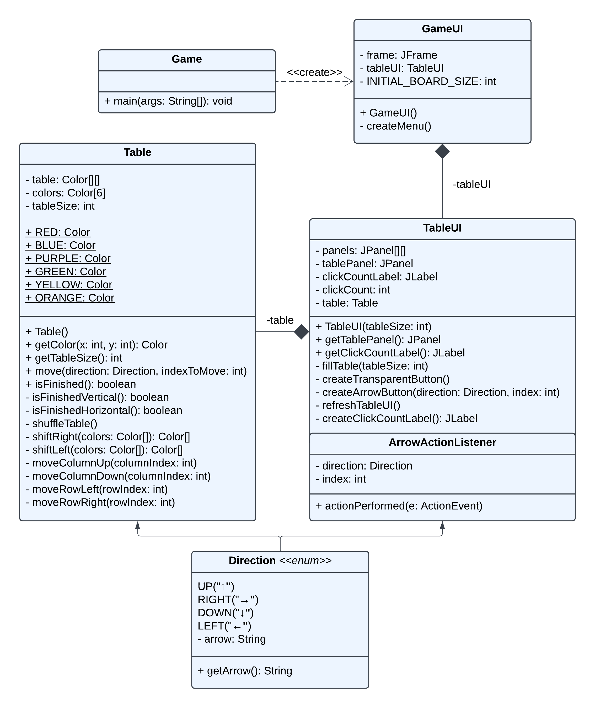

# 🎲 Rubik's Table Game

This project was developed as a **university assignment**, focusing on creating a simulation of the **Rubik's Table** game. A detailed documentation is also available to guide users through the code and functionality of the game.

## 🚀 Features

- **Interactive UI**: Graphical user interface using Java Swing.
- **Dynamic Game Board**: Supports different board sizes (2x2, 4x4, 6x6).
- **Colorful Gameplay**: Custom color definitions for a vibrant game experience.
- **Row and Column Shifting**: Move rows and columns in four directions (UP, DOWN, LEFT, RIGHT).
- **Game Completion Check**: Automatically checks if the game is completed.

## 📋 Project Details

- **University**: ELTE
- **Year**: 2024
- **Technologies**: Java, Swing

## 📚 Detailed Documentation

There is a detailed documentation included with a detailed tour to understand the code. Below is the UML diagram for the project:

---

⭐ This was a university project and is not actively maintained.
